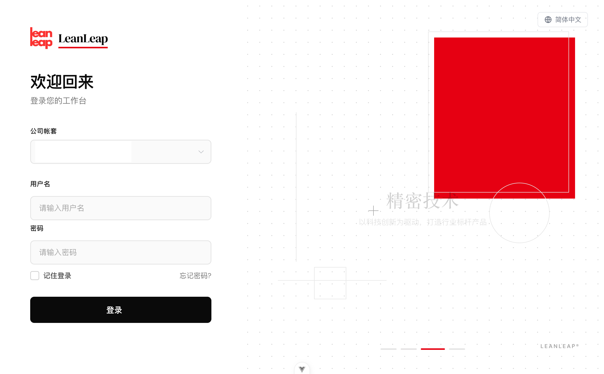
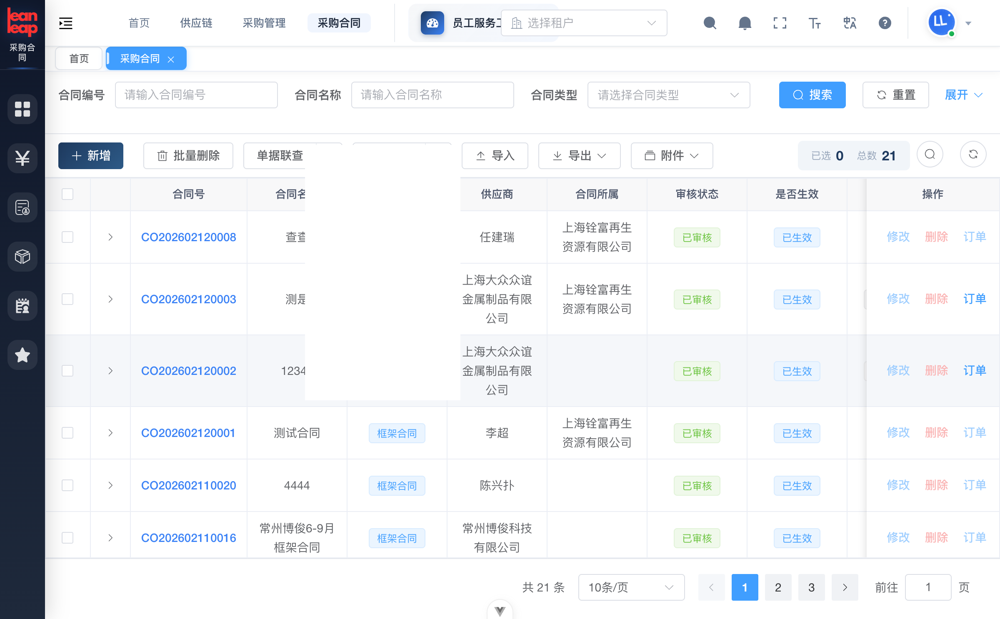
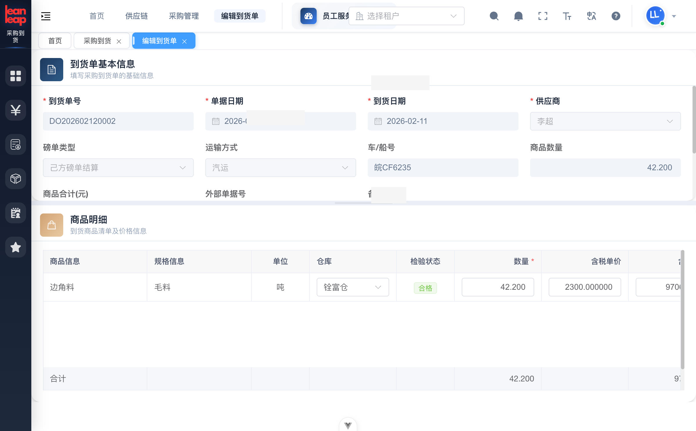
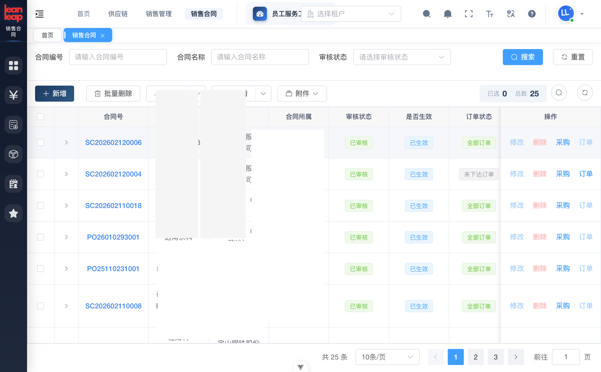
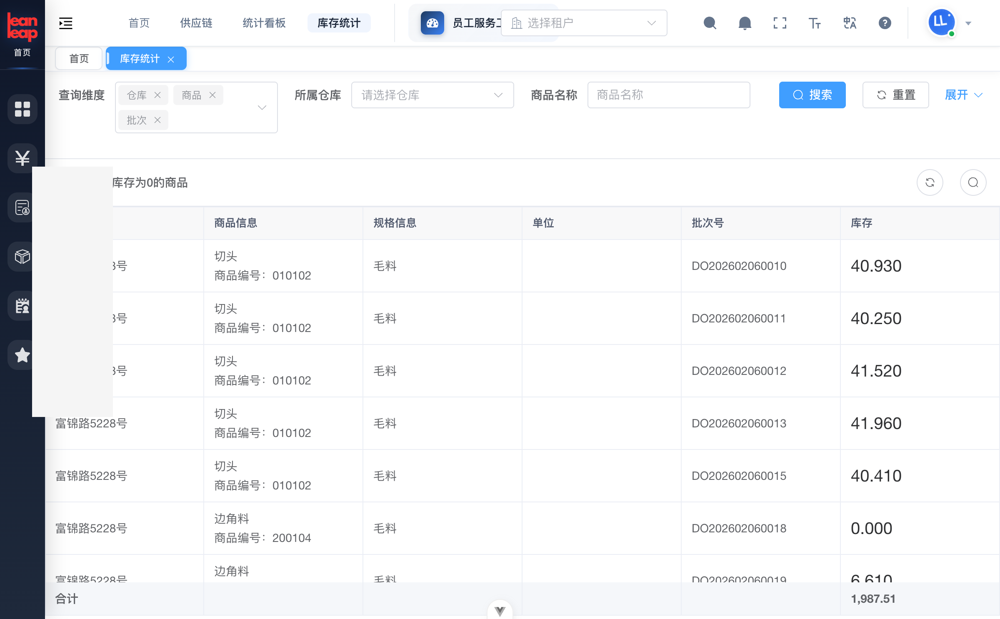
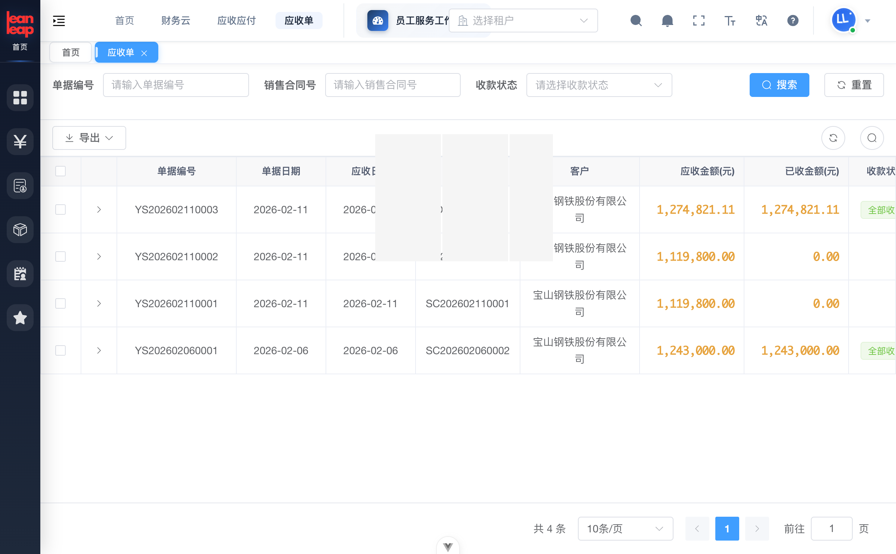
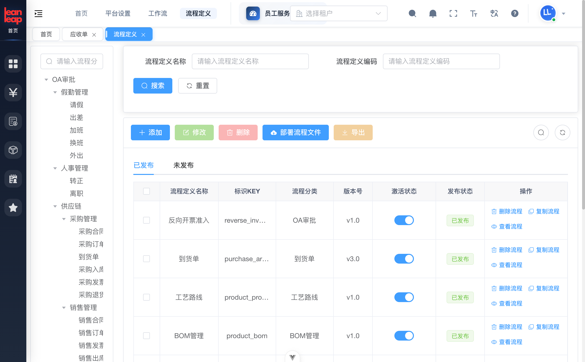

# 一套系统管全链路！制造业数字化转型的「终极答案」

> 从采购到交付，从车间到财务——如何用一套系统搞定全部？

---

在制造业数字化的浪潮中，你是不是也遇到过这些问题：

❌ 采购系统和财务系统各自为政，对账要命  
❌ 生产车间和仓库各用各的表格，信息不同步  
❌ 销售数据反馈不到供应链，总是缺货或压货  
❌ 上了好几套系统，结果数据孤岛更多了  

**据IDC数据，约60%的制造企业深陷「数据孤岛」困境。**

今天，我们带来一个解决方案——

**领跃协同制造管理系统（LeanLeap）**

一套系统，打通采购、销售、仓储、生产、财务全流程。

---

## 🏭 01 系统长什么样？

先看几张图感受一下👇

**登录界面** —— 支持多租户切换、多语言选择



**首页工作台** —— 待办任务、常用功能、一目了然


技术架构上，系统采用 **Spring Boot 3 + Vue 3 + TypeScript**，支持：

✅ **多租户** —— 集团多公司独立运营，数据隔离  
✅ **多语言** —— 中文/繁体/英文，外贸企业也能用  
✅ **多数据库** —— PostgreSQL、MySQL、Oracle 都支持  

---

## 📦 02 采购管理：从合同到入库，全链路闭环

采购是成本控制的第一道防线。

系统提供完整链路：

```
采购合同 → 采购订单 → 到货管理 → 入库检验 → 采购发票
```

**采购合同列表**：按供应商、状态、时间多维度管理



**亮点功能：双方磅单核对** 🔥

大宗原材料采购时，系统同时记录「我方数据」和「对方数据」：

- 数量、单价、金额自动对比
- 差异一眼看出，防止计量争议



---

## 💰 03 销售管理：合同→出库→结算，一气呵成

销售模块与采购模块镜像对称：

```
销售合同 → 销售订单 → 销售出库 → 销售发票 → 客户结算
```



出库时自动校验库存、扣减批次，确保账实一致。

结算单汇总多笔出库，支持按合同或按周期灵活结算。

---

## 🏪 04 仓储管理：库存实时可视，批次精准追溯

仓储是供应链的「心脏」。



系统支持：

📍 **多仓库管理** —— 按工厂、区域设置，灵活划分库区库位  
📍 **批次管理** —— 先进先出（FIFO）、指定批次出库  
📍 **实时查询** —— 仓库、商品、批次多维度，数据实时准确  
📍 **盘库 & 调拨** —— 自动计算盘盈盘亏，跨仓调配一键完成  

---

## ⚙️ 05 生产执行：工单→完工，全流程管控

对制造企业来说，车间才是核心战场。

**生产工单列表**：


支持甘特图视图，按日/周/月切换，逾期工单一眼看出。

**工厂全景3D可视化** 🔥

这是领跃的特色功能——把工厂数字化呈现：


工作中心、生产线、区域、工位……全部可视化管理。

**完整的生产体系**：

| 模块 | 功能 |
|------|------|
| BOM管理 | 多层级物料清单，版本管理 |
| 工艺路线 | 工序定义、工时标准 |
| 工序派工 | 分解到班组、工位 |
| 质量管理 | 检验标准、成品检验、缺陷追溯 |
| 领料管理 | 关联工单，精准控制消耗 |

---

## 💵 06 财务管理：业财一体化

财务不是孤立的——领跃把财务和业务深度打通。

**应收单管理**：自动根据销售出库生成



**核心功能**：

✅ 应收/应付自动生成，告别手工录入  
✅ 收付款自动核销，资金往来可追溯  
✅ 调价单管理，价格变更可审计  

---

## 📋 07 审批流程：25+个流程开箱即用

企业运营少不了审批。领跃内置 **25+ 个审批流程**：



覆盖范围：

| 业务域 | 流程 |
|--------|------|
| OA审批 | 请假、出差、加班、换班、外出 |
| 人事 | 转正、离职 |
| 采购 | 合同、订单、入库、发票、退货 |
| 销售 | 合同、订单、出库、发票、结算 |
| 库存 | 出库、入库、盘库、调拨 |
| 生产 | 工单、BOM、工艺路线 |
| 财务 | 调价、付款、收款 |

**可视化流程设计器**：拖拽式设计，不懂代码也能用


---

## 🔒 08 安全与管理：企业级保障

**多租户隔离** —— 数据库级+缓存级双重隔离  
**精细权限** —— 菜单/按钮/数据/接口四级控制  
**操作日志** —— 关键操作全记录，审计无忧  
**安全认证** —— Sa-Token + JWT，多设备登录管控  

---

## ✨ 为什么选择领跃？

| 特点 | 说明 |
|------|------|
| **全链路覆盖** | 采购+销售+仓储+生产+财务+OA，一套搞定 |
| **开箱即用** | 25+审批流程、标准业务单据，快速上线 |
| **灵活扩展** | 模块化架构，按需选择 |
| **技术先进** | Spring Boot 3 + Vue 3，性能卓越 |
| **数据驱动** | 全方位看板统计，用数据说话 |

---

## 📞 写在最后

过年了🧨，先给各位制造业老板拜个早年！

但是——年可以过，**账不能糊涂**。

趁着走亲戚的间隙，不妨想想这几个问题：隔壁厂已经用AI排产了，你还在用Excel拉排程？同行的库存周转快了两倍，你的仓库还在靠"老师傅的记忆"管理？「十五五」规划白纸黑字写着——到2027年，规模以上企业关键工序数控化率要超**85%**。留给"再等等看"的时间，真的不多了。

好消息是，数智化转型不用"伤筋动骨"。

**领跃协同制造管理系统**，一套系统管住采购、生产、仓储、财务全链路——开工就能上，上了就能用，用了就有效。与其年后焦虑，不如**年前先了解，年后直接干**。

---

👉 **春节期间咨询不打烊！扫码预约年后产品演示，开工即领跑 🐴**

新的一年，愿您的工厂像这匹马一样——**马力全开，一路领跃**。

---

*领跃科技出品 | 转载请注明出处*
